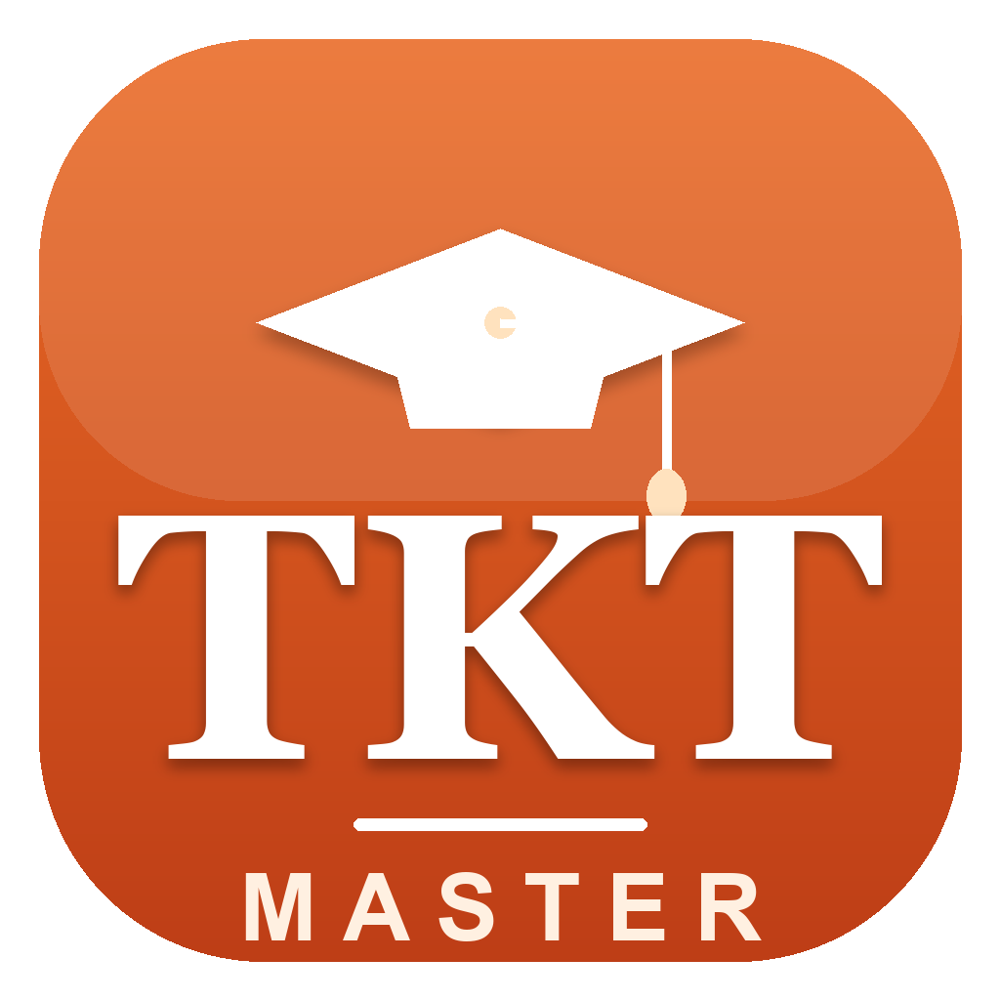

<div align="center">

```
████████╗██╗  ██╗████████╗   ███╗   ███╗ █████╗ ███████╗████████╗███████╗██████╗
╚══██╔══╝██║ ██╔╝╚══██╔══╝   ████╗ ████║██╔══██╗██╔════╝╚══██╔══╝██╔════╝██╔══██╗
   ██║   █████╔╝    ██║      ██╔████╔██║███████║███████╗   ██║   █████╗  ██████╔╝
   ██║   ██╔═██╗    ██║      ██║╚██╔╝██║██╔══██║╚════██║   ██║   ██╔══╝  ██╔══██╗
   ██║   ██║  ██╗   ██║      ██║ ╚═╝ ██║██║  ██║███████║   ██║   ███████╗██║  ██║
   ╚═╝   ╚═╝  ╚═╝   ╚═╝      ╚═╝     ╚═╝╚═╝  ╚═╝╚══════╝   ╚═╝   ╚══════╝╚═╝  ╚═╝
```

### 🎓 Ace the Cambridge **TKT** — Modules 1, 2 & 3 — on your Mac. Free. Offline. Forever.


**[⬇️ Download for macOS](../../releases/latest)**  ·  by **[EduPocket.org](https://www.EduPocket.org)**



</div>

---

## 🌟 Why TKT Master?

> A complete, **offline** teacher‑training companion that takes you from zero to a **top band** — no account, no subscription, no internet. You own it.

|  |  |
|---|---|
| 📚 **All 33 units** | Full bilingual lessons for every unit of Modules 1, 2 & 3 — the way *The TKT Course* is organised. |
| 🧠 **Rich Key Terms** | Each term with **sub‑branches + examples** and one‑tap **pronunciation** (🇬🇧 British / 🇺🇸 American). |
| ✅ **Smart Practice** | Exam‑style multiple‑choice & matching, each with a **full explanation of why every option is right or wrong**. |
| ⏱️ **Mock Tests** | Timed, exam‑realistic tests with a **predicted band** — timing 10% tighter than the real exam to make you stronger. |
| 📖 **Glossary (760+ terms)** | Searchable; tap any term for a full mini‑lesson with examples, clickable cross‑references & related questions. |
| 🌍 **CLIL & CELTA Extras** | Deeper teaching knowledge (CLIL 4Cs, BICS/CALP, Thornbury, Scrivener) to sharpen your reasoning. |
| 🎧 **Focus Mode** | Optional calm, generative study music + soft sound effects. Fully offline. |
| 🧩 **Smart Review** | The app remembers what you get wrong and builds focused review sessions automatically. |
| 🇮🇷 **Bilingual** | English‑first with full **right‑to‑left Persian** support throughout. |

---

## ⬇️ Install (60 seconds)

1. **[Download `TKT-Master-macOS.zip`](../../releases/latest)** and unzip.
2. Drag **TKT Master.app** to your **Applications** folder.
3. First launch: **right‑click the app → Open → Open**.
   *(One‑time macOS prompt, because the app uses a free ad‑hoc signature.)*

> 🖥️ Requires **macOS 14 (Sonoma)+** · Universal binary (Apple Silicon **and** Intel) · ~1 MB.

---

## 🛠️ Build from source

```bash
git clone https://github.com/esfandiari1991/TKT-Master.git
cd TKT-Master
./build.sh           # compiles a universal binary with swiftc — no Xcode, no sudo
open "build/TKT Master.app"
```

---

## ⚖️ Disclaimer

TKT Master is an **independent** study app built on the publicly available Cambridge English TKT syllabus and glossary terminology. It is **not affiliated with, endorsed by, or sponsored by** Cambridge University Press & Assessment. *"TKT"* and *"Cambridge"* are trademarks of their respective owners.

---

<div align="center">

## فارسی 🇮🇷

**TKT Master** — اپلیکیشن نیتیو و **کاملاً آفلاینِ** مک برای قبولی با **نمرهٔ کامل** در آزمون **TKT کمبریج** (ماژول‌های ۱، ۲ و ۳).

</div>

- 📚 **درسنامهٔ کاملِ هر ۳۳ یونیت** به‌صورت دوزبانه (انگلیسی + پشتیبانیِ کاملِ فارسیِ راست‌به‌چپ).
- 🧠 **اصطلاحاتِ کلیدی** با زیرشاخه و مثال و **تلفظِ آفلاین** (بریتیش/امریکن).
- ✅ **سؤال‌های شبیه‌آزمون** با **توضیحِ کاملِ «چرا هر گزینه»**.
- ⏱️ **آزمون‌های زمان‌دار** با **باندِ پیش‌بینی‌شده** (تایمینگ ۱۰٪ فشرده‌تر از آزمونِ واقعی).
- 📖 **واژه‌نامهٔ ۷۶۰+ اصطلاحی** با درسنامهٔ کاملِ هر اصطلاح + ارجاع‌های کلیک‌شونده.
- 🌍 بخشِ **CLIL و CELTA**، 🎧 موسیقیِ تمرکزِ آفلاین، و 🧩 مرورِ هوشمند.

> بدون اشتراک، بدون اینترنت، بدون حساب کاربری — **مالِ خودت.**

<div align="center">

**Made with ❤️ by [EduPocket.org](https://www.EduPocket.org) — durable, offline learning tools you own.**

</div>
